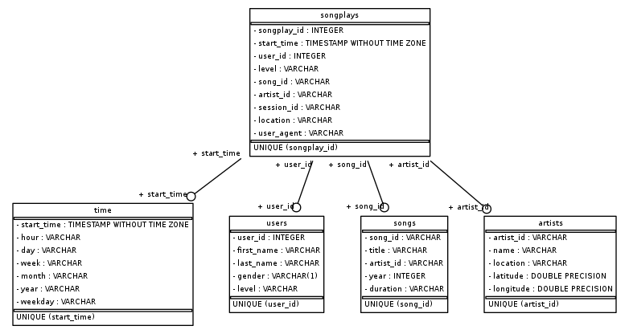

# Purpose of Sparkify database

Sparkify wants to analyze the data they've been collecting on songs and user activity on their new music streaming app. The analytics team is particularly interested in understanding what songs users are listening to. Currently, they don't have an easy way to query their data, which resides in a directory of JSON logs on user activity on the app, as well as a directory with JSON metadata on the songs in their app.

They'd like to create a Postgres database with tables designed to optimize queries on song play analysis, and bring you on the project. We have created a database schema and ETL pipeline for this analysis.

# How to run Python scripts

Run the Python scritps in the following order :
python sql_queries.py
python create_tables.py
python etl.py

# Files

The files are:
- create_tables.py : this is a script that initailize the database
- etl.ipynb : a notebook to test databases creation with some examples
- etl.py : production script to insert data into databases
- sql_queries : all queries needed to create, drop and insert data in the databases
- test.ipynb : check that our script does a good job

# Database schema design and ETL pipeline
### Schema for Song Play Analysis

Using the song and log datasets, we have created a star schema optimized for queries on song play analysis. 
This includes the following tables.

**Fact Table**

*songplays* - records in log data associated with song plays i.e. records with page NextSong
* songplay_id, 
* start_time, 
* user_id, 
* level, 
* song_id, 
* artist_id, 
* session_id, 
* location, 
* user_agent

**Dimension Tables**

*users* - users in the app
* user_id, 
* first_name, 
* last_name, 
* gender, 
* level

*songs* - songs in music database
* song_id, 
* title, 
* artist_id, 
* year, 
* duration

*artists* - artists in music database
* artist_id, 
* name, 
* location, 
* latitude, 
* longitude
    
*time* - timestamps of records in songplays broken down into specific units
* start_time, 
* hour, 
* day, 
* week, 
* month, 
* year, 
* weekday

ERD Diagram :

# Example queries and results for song play analysis.
See test.ipynb notebook to view example queries.